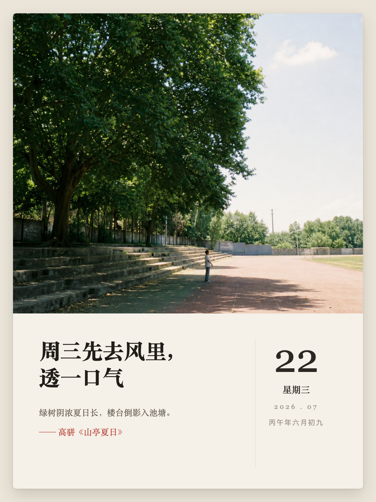
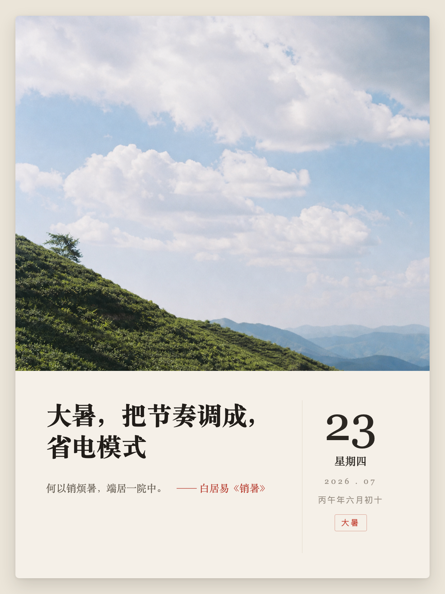
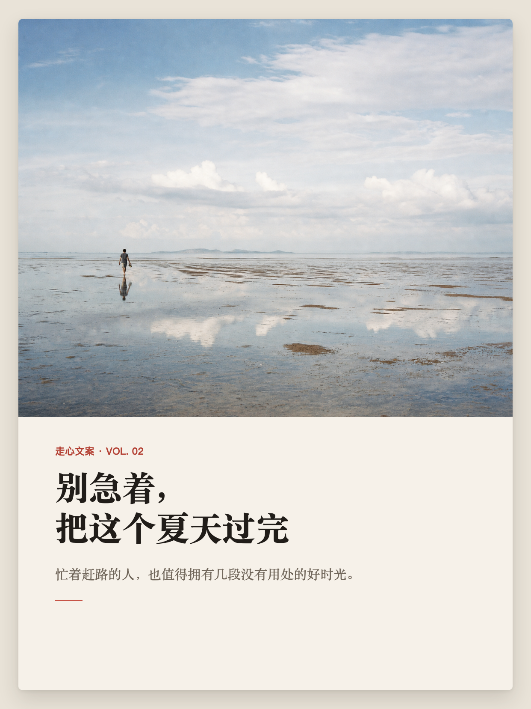

# Rednote Content Kit

[简体中文（默认）](README.md) | [English](README.en.md)

[](https://github.com/xingxi0614-cpu/rednote-content-kit/actions/workflows/ci.yml)


An open-source Codex workflow that uses a host-provided imagegen/Imagen capability to create dated calendar cards and no-date heartfelt albums locally, with clean background generation, copy, privacy checks, and a manual publishing handoff.

**It prepares the content, but it never logs in, uploads, or publishes for you.**

## Why this project exists

Image-post creation involves more than writing a caption. Common failures include incorrect image order, copy that does not match the visuals, excessive topics, unreliable attribution, leaked local paths, or handing account credentials to automation.

This project turns those steps into a reusable, verifiable, local-only workflow. The output is a set of images, copy-ready text, a JSON manifest, and a manual checklist, while the user keeps control of the account.

## Example output

### Dated calendar cards

The calendar Skill supports ordinary dates and exact-day solar-term cards. Date, weekday, lunar, and solar-term labels are reviewed before rendering.

<p align="center">
  
  
</p>

### No-date heartfelt albums

The album Skill defaults to `1 cover + 6 inner cards` and supports photo-paper or full-bleed handwritten layouts.

<p align="center">
  
  
  
</p>


See [example provenance and checks](docs/EXAMPLES.en.md) for dimensions, safety review, and SHA-256 values.

## Features

- Build a content brief covering audience, scene, objective, evidence, and intended next action.
- Plan dated cards, single-image notes, or no-date albums.
- Generate clean photographic backgrounds when the host exposes imagegen/Imagen; otherwise emit an explicit image plan instead of presenting placeholders as photography.
- Prepare recommended and alternative titles, captions, topics, and a comment starter.
- Validate image type and order, topic limits, attribution, and copy-image consistency.
- Copy only selected images into a clean handoff directory with relative paths and SHA-256 hashes.
- Generate `handoff.md` and `manifest.json` for manual copy and upload.
- Use Simplified Chinese by default or switch to English when requested.

## Three core creation Skills

### `rednote-dated-calendar`

Creates a verified 3:4 photo-paper calendar card for one exact date. It validates the Gregorian date and weekday, requires human review of lunar and solar-term labels, prepares copy and an image prompt, invokes the image-assets workflow for finished requests, and strictly renders a `1242 × 1656` PNG through local Chrome.

### `rednote-heartfelt-album`

Turns one specific feeling or life scene into a seven-card carousel: `1 cover + 6 inner cards`, three title directions, caption, topics, per-card image prompts, source checks, seven distinct backgrounds, and strict local HTML/PNG rendering.

### `rednote-image-assets`

Completes the visual layer. It creates a machine-readable image plan from a calendar or album spec, uses the host's existing imagegen/Imagen capability, checks dimensions and duplicate files, safely binds local images to a new spec, and hands that spec to the calendar or album renderer. The plugin never asks for or stores an image-provider API key.

## Complete visual pipeline

```text
theme or date
  → copy and image prompts
  → host imagegen/Imagen creates clean backgrounds
  → local validation and spec binding
  → deterministic Chrome composition
  → 1242×1656 PNG files and contact sheet
```

The GitHub repository bundles the workflow, prompts, validation, binding, and rendering code. The image model, quota, and service terms belong to the host application. If image generation is unavailable, users may provide their own images. Without either source, the Skill stops at the image plan and reports the package as incomplete.

## Two supporting safety Skills

### `rednote-content-pack`

Creates the complete local content and handoff package: brief, image plan, titles, caption, topics, image order, validation, and packaged output.

### `rednote-manual-publish-guard`

Converts requests to upload, save drafts, schedule, or publish into a safe manual checklist without accessing the platform or account credentials.

## Installation

### Install as a Codex Plugin

```bash
codex plugin marketplace add xingxi0614-cpu/rednote-content-kit
```

Restart the ChatGPT desktop app, open Plugins, select Rednote Content Kit, and install it.

### Install a Skill manually

Copy the required Skill directories from `plugins/rednote-content-kit/skills/` into the following location. Complete photographic output also requires `rednote-image-assets`:

```text
$HOME/.agents/skills/
```

See [Installation](docs/INSTALL.en.md) for details.

## Example prompts

```text
Create a verified local calendar card for July 23, 2026.
Check the weekday and require review of the lunar and solar-term labels.
Use the host imagegen/Imagen capability for a clean background and strictly render the final PNG.
```

```text
Create a seven-card Xiaohongshu album about slowing down.
Generate seven distinct clean backgrounds, reject placeholders, and prepare the final PNG files,
titles, caption, topics, contact sheet, and manual image order in English.
```

```text
Package these images locally. Do not log in to or operate Xiaohongshu.
```

## Deterministic handoff builder

Create a UTF-8 JSON spec and run:

```bash
python3 plugins/rednote-content-kit/skills/rednote-content-pack/scripts/build_handoff.py \
  --spec /path/to/package-spec.json \
  --output /path/to/dist/package-id
```

The builder emits `handoff.md`, `manifest.json`, and an ordered `images/` directory. Omit `language` for the default `zh-CN`, or set it to `en` for English. See the [English schema](plugins/rednote-content-kit/skills/rednote-content-pack/references/package-schema.en.md).

## Privacy and security boundary

- No Xiaohongshu/RedNote login.
- No cookies, tokens, passwords, verification codes, or browser sessions.
- No upload, draft saving, scheduling, publishing, comments, or messages.
- No telemetry or runtime network requests.
- No source-machine absolute paths in the handoff.
- Rejects symlinks, path traversal, disguised images, oversized files, and non-empty output directories.
- Users remain responsible for rights to images, fonts, quotations, and other materials.

## Validation

```bash
python3 -m unittest discover -s tests -v
python3 tools/audit_release.py .
```

## Contributing

Issues and pull requests are welcome. Use synthetic reproduction data and never attach real account data, credentials, unpublished images, private analytics, or conversations. See `CONTRIBUTING.md` and `SECURITY.md`.

## Commercial use and support

The MIT License permits commercial use. Installation, custom templates, team training, private extensions, and ongoing support may be offered as separate paid services without changing the repository license.

## Independent project notice

This is an independent community project and is not affiliated with, endorsed by, or sponsored by Xiaohongshu/RedNote. Platform names are used only to describe the intended workflow. Users are responsible for applicable law, platform rules, and content rights.

## License

[MIT License](LICENSE) © 2026 Rednote Content Kit Contributors
